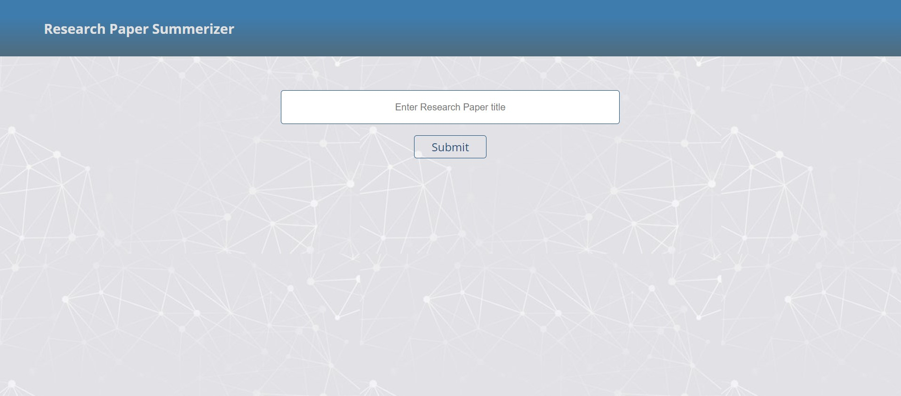
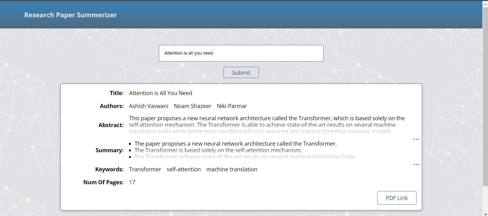

[](https://github.com/siddusaikumar-git/ResearchPaperSummerizer/blob/master/LICENSE)

[](https://vscode.dev/github/microsoft/siddusaikumar-git/ResearchPaperSummerizer)

# Research Paper Summerizer using ChatGPT prompt Engineering

This is a Web Application to summarize the Research papers based on title using ChatGPT prompt engineering, which provide chatgpt prompt service for research papers using [NextJS](https://nextjs.com), Python and Flask libraries.

## Getting Started

First create an openai key from [openai](https://openai.com)

Goto `backend` folder and do the following

Second create `.env` file, then update with openai key as below

> OPENAI_API_KEY=<openai_key>

Now, before starting the server, install dependencies by executing following command.

```bash
pip install -r requirements.txt
```

Finally to start the backend server, run the following command.

```bash
python service.py
```

Keep the backend server running, open another terminal and Goto `frontend` folder and do the following

First install dependencies

```bash
npm install
```

To start the development server, run the following command.

```bash
npm run dev
```

Open [http://localhost:3000](http://localhost:3000) with your browser to see the web application.

Now Enter the research paper title to see the result.



After receiving the results



This repository is licensed under the MIT license. See the [LICENSE](LICENSE) file for more information.
